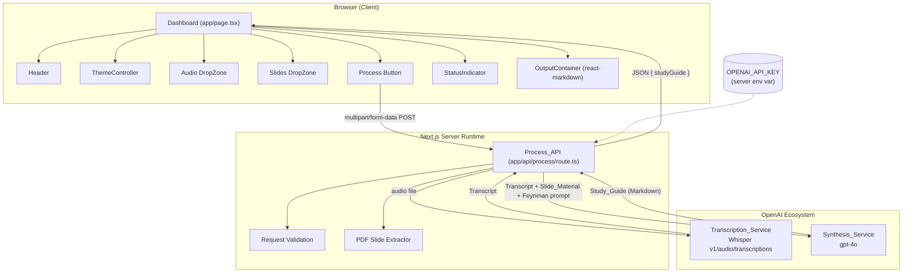
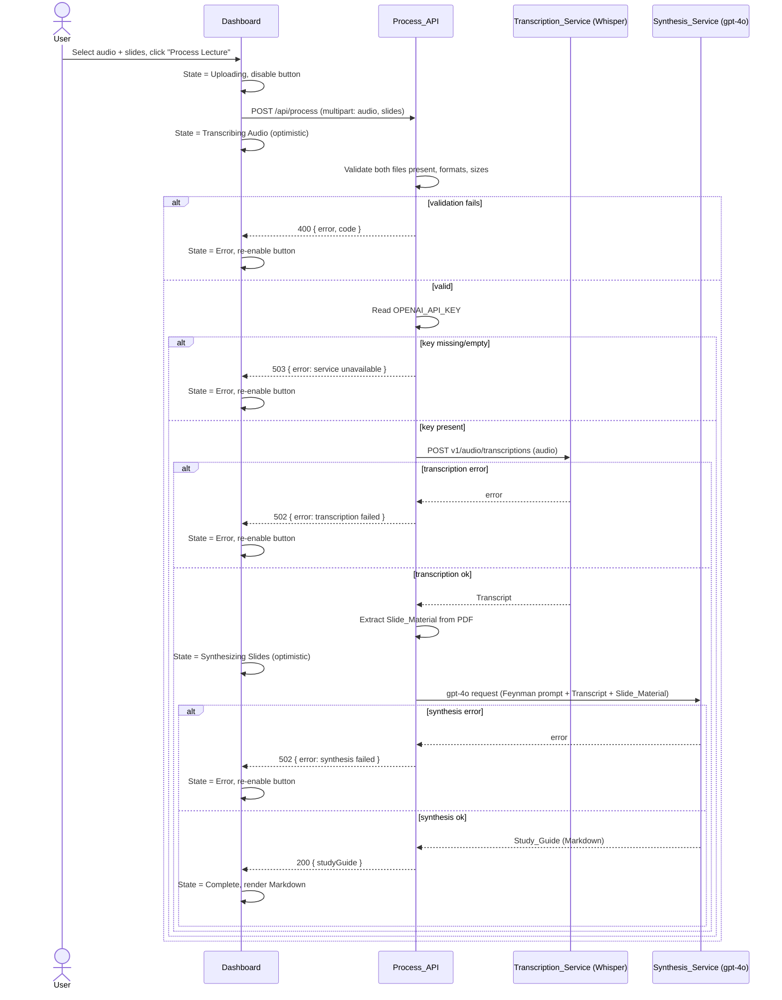

# Design Document

## Overview

The AI Lecture Companion is a Next.js (App Router) full-stack application. It consists of a single-page client dashboard (`app/page.tsx`) and one serverless API route (`app/api/process/route.ts`). The client collects a lecture audio file and a slide-deck PDF, submits them as multipart form data, and renders the returned Markdown study guide. The server orchestrates a two-stage OpenAI pipeline: Whisper transcription (`v1/audio/transcriptions`) followed by gpt-4o multimodal synthesis using the verbatim Feynman system prompt.

The design deliberately keeps the surface small for the Phase 1 MVP:

- **One route, one responsibility.** All heavy lifting (validation, transcription, PDF extraction, synthesis) lives in the single `Process_API` route so the client stays a thin, presentational layer. (Requirements 7, 8)
- **Credentials never leave the server.** The OpenAI key is read from a server-side environment variable and is excluded from every response. (Requirements 7.6, 7.7, 7.8)
- **Forward-only state machine on the client.** The `Status_Indicator` reflects a strictly ordered progression so the user always understands how far along processing is. (Requirement 6)

### Research Notes and Key Decisions

Research during design focused on three areas that shape the architecture. Findings are summarized below and folded into the sections that follow.

1. **Whisper file-size limits vs. the 500 MB requirement.** OpenAI's `v1/audio/transcriptions` endpoint historically enforces a 25 MB per-request upload limit. `Max_Audio_Size` is 500 MB (Requirement 3.7 / glossary), which is the *client-side selection* ceiling, not a guarantee Whisper will accept the file. The design treats the 500 MB check as UI-level validation (Requirement 3.7) and treats an oversized-for-Whisper rejection as a normal `Transcription_Service` error surfaced through the transcription-failed path (Requirements 7.5, 10.2). This keeps the MVP honest: we validate what the requirements mandate and map upstream rejections to the defined error contract rather than silently failing. (Content was rephrased for compliance with licensing restrictions; see [OpenAI Speech to Text guide](https://platform.openai.com/docs/guides/speech-to-text).)

2. **Single POST cannot natively express staged progress.** A standard `fetch` POST yields exactly one response after the whole pipeline completes, yet Requirement 6 wants the user to see `Transcribing Audio...` then `Synthesizing Slides...`. Two viable approaches: (a) **optimistic staged updates** driven by a client timer/sequence, or (b) **streaming** the stages via a `ReadableStream` (NDJSON/SSE) from the route. For the MVP we choose **optimistic staged updates** for simplicity and reliability, with a clean seam to upgrade to streaming later. Details in [Client State Management](#client-state-management).

3. **PDF parsing for multimodal input.** gpt-4o accepts text and images. Slides are visual (diagrams, formulas, charts), so text-only extraction loses information. The design extracts **slide text** (fast, cheap) and **optionally renders pages to images** for true multimodal synthesis, with text-only as a guaranteed fallback. Details in [PDF Parsing Approach](#pdf-parsing-approach).

## Architecture

The system is a full-stack Next.js App Router application. The browser runs the client dashboard; Next.js server runtime hosts the `Process_API` route which is the only component that talks to OpenAI.



Key architectural boundaries:

- **Client ↔ Server**: one HTTP boundary, `multipart/form-data` request in, JSON response out. The client never sees the OpenAI key or raw upstream payloads. (Requirement 7.8)
- **Server ↔ OpenAI**: server-only. The route reads `OPENAI_API_KEY`, calls Whisper, then gpt-4o. (Requirements 7.3, 7.6, 8.2)
- **Runtime**: the route runs on the Node.js runtime (not Edge) because PDF parsing and multipart handling of large files rely on Node libraries and buffers.

### Processing Pipeline Sequence



Note the optimistic client transitions (`Transcribing Audio`, `Synthesizing Slides`) happen on the client timeline while the single POST is in flight; the server's terminal response drives the final `Complete`/`Error` transition. This is the pragmatic MVP approach discussed in [Client State Management](#client-state-management).

## Components and Interfaces

### Frontend Components

All components are React function components styled with Tailwind CSS. Icons come from `lucide-react`. Markdown rendering uses `react-markdown`.

#### Header
- Renders the fixed title text "AI Lecture Companion" and hosts the `ThemeController` toggle. (Requirement 1.1)
- Receives the active theme so it re-styles with the rest of the Dashboard. (Requirement 2.7)

#### ThemeController
- Props: `theme: Theme`, `onToggle: () => void`.
- Renders a toggle (e.g., `Sun`/`Moon` lucide icons) that flips between `"dark"` and `"light"`.
- Applies the theme by toggling the `dark` class on the document root (Tailwind `darkMode: "class"`), with a CSS transition ≤ 500 ms. (Requirements 2.1, 2.3, 2.7)
- Persists the choice to `localStorage` under a fixed key. On mount, reads the stored value; defaults to `"light"` when absent or unreadable. (Requirements 2.2, 2.4, 2.5, 2.6)

#### DropZone (reused for Audio and Slides)
A single reusable component configured by props so both zones share identical behavior with different validation config.

- Props:
  - `label: string` — e.g., "Lecture Audio" / "Lecture Slides".
  - `config: FileValidationConfig` — accepted extensions, max size, and multi-file drop policy.
  - `selectedFile: File | null`.
  - `onFileAccepted: (file: File) => void`.
  - `onValidationError: (message: string) => void`.
- Behavior:
  - Supports both drag-and-drop and a click-to-open file picker. (Requirements 3.1, 3.2, 4.1, 4.2)
  - On a valid file, calls `onFileAccepted` and shows the file name. (Requirements 3.3, 4.3)
  - Validates extension and size against `config`; on failure calls `onValidationError` with the requirement-specified message and does **not** clear the previously accepted file. (Requirements 3.4, 3.7, 4.4, 4.7)
  - Replaces an existing valid file when a new valid file is accepted. (Requirements 3.5, 4.5)
  - Multi-file drop policy differs per zone: Audio **rejects** multi-file drops with a message (Requirement 3.6); Slides **takes only the first** file and ignores the rest (Requirement 4.6). This difference is encoded in `config.multiDropPolicy`.

#### Process Button
- Label "Process Lecture". (Requirement 5.1)
- `disabled` when either file is unselected OR `Processing_State ∈ {Uploading, Transcribing Audio, Synthesizing Slides}`. (Requirements 5.2, 5.3)
- On click, triggers the submission flow. (Requirement 5.4)

#### StatusIndicator
- Props: `state: ProcessingState`, `errorMessage?: string`.
- Maps each `ProcessingState` to display text:
  - `Idle` → "Ready" (Requirements 1.5, 6.1)
  - `Uploading` → "Uploading..." (Requirement 6.2)
  - `TranscribingAudio` → "Transcribing Audio..." (Requirement 6.3)
  - `SynthesizingSlides` → "Synthesizing Slides..." (Requirement 6.4)
  - `Complete` → "Complete!" (Requirement 6.5)
  - `Error` → the error message / error text (Requirements 6.7, 10.4)

#### OutputContainer
- Props: `studyGuide: string | null`.
- When `studyGuide` is `null` (none received yet), shows placeholder text describing where the guide will appear. (Requirements 1.5, 9.3)
- When `studyGuide` is a non-empty, non-whitespace string, renders it with `react-markdown`, supporting headings h1–h6, ordered/unordered lists, bold/italic, and fenced/inline code. (Requirements 9.1, 9.2)
- When `studyGuide` is empty or whitespace-only, shows a "no study guide content available" message and retains the placeholder. (Requirement 9.4)

### Backend: Process_API

`POST app/api/process/route.ts`, Node.js runtime.

Pipeline steps in order:

1. **Parse & validate request** (Requirements 7.1, 7.2, 10.1)
   - Read `FormData`; require fields `audio` and `slides`, each exactly one file.
   - Validate audio extension ∈ `.mp3/.wav/.m4a` and size ≤ `Max_Audio_Size`.
   - Validate slides extension = `.pdf` and size ≤ `Max_Slides_Size`.
   - On any failure: return `400` with `{ error, code }` identifying the failed constraint, **without** contacting OpenAI.
2. **Read credentials** (Requirements 7.6, 7.7)
   - Read `OPENAI_API_KEY`. If absent/empty, return `503 { error: "Service unavailable" }` without contacting OpenAI.
3. **Transcribe** (Requirements 7.3, 7.4, 7.5)
   - Send audio to Whisper `v1/audio/transcriptions`. On success capture `Transcript`. On error, abort with `502 { error: "Transcription failed" }` and retain no partial transcript.
4. **Extract Slide_Material** (Requirement 8.1) — see [PDF Parsing Approach](#pdf-parsing-approach).
5. **Synthesize** (Requirements 8.2, 8.3, 8.4, 8.5)
   - Call gpt-4o with the verbatim `Feynman_System_Prompt` plus a user message containing the `Transcript` and `Slide_Material` (text and, when available, page images).
   - On success return `200 { studyGuide }`. On error return `502 { error: "Synthesis failed" }`.
6. **Credential exclusion** (Requirement 7.8) — response bodies contain only the study guide or an error message/code; the key and raw OpenAI request headers are never serialized into a response.

#### HTTP status contract

| Condition | Status | Body | Requirements |
| --- | --- | --- | --- |
| Missing/invalid audio or slides | 400 | `{ error, code }` | 7.2, 10.1 |
| Missing/empty API key | 503 | `{ error }` | 7.7 |
| Transcription error | 502 | `{ error }` | 7.5, 10.2 |
| Synthesis error | 502 | `{ error }` | 8.5, 10.3 |
| Success | 200 | `{ studyGuide }` | 8.4 |

## PDF Parsing Approach

Slide decks carry meaning in both text and visuals. The extractor produces a `SlideMaterial` value with two optional channels:

- **Text channel** (always attempted): extract per-page text using a Node PDF text library (e.g., `pdf-parse` or `pdfjs-dist` text content). Cheap, fast, and a guaranteed input to gpt-4o even when rendering is unavailable.
- **Image channel** (best-effort, enables true multimodal): render each PDF page to a raster image (e.g., via `pdfjs-dist` + a canvas backend, or `pdf-to-img`) and pass the images as `image_url`/base64 content parts to gpt-4o so it can read diagrams, plots, and formula layouts. (Requirement 8.1 permits "text and/or images.")

MVP policy:

- Always include the extracted **text**.
- Include **images** when rendering succeeds; cap the number of page images (e.g., first N pages) to bound token/cost and payload size.
- If both channels fail to produce anything usable, treat it as an extraction failure and surface it through the synthesis-failed error path so the client still gets the defined error contract. (Requirements 8.5, 10.3)

This keeps synthesis robust: text-only always works, images enhance quality when they render.

## Data Models

### Shared Types

```typescript
// Processing state — forward-only ordering is enforced by transition logic (Requirement 6.6)
export enum ProcessingState {
  Idle = "Idle",
  Uploading = "Uploading",
  TranscribingAudio = "TranscribingAudio",
  SynthesizingSlides = "SynthesizingSlides",
  Complete = "Complete",
  Error = "Error",
}

// Ordinal ordering used to enforce forward-only progression on the client.
// Error is terminal and reachable from any active stage; it is not part of the linear order.
export const STATE_ORDER: ProcessingState[] = [
  ProcessingState.Idle,
  ProcessingState.Uploading,
  ProcessingState.TranscribingAudio,
  ProcessingState.SynthesizingSlides,
  ProcessingState.Complete,
];

export type Theme = "light" | "dark";

// Multi-file drop differs per zone (Requirements 3.6 vs 4.6)
export type MultiDropPolicy = "reject" | "firstOnly";

export interface FileValidationConfig {
  field: "audio" | "slides";
  acceptedExtensions: string[]; // e.g. [".mp3", ".wav", ".m4a"] or [".pdf"]
  maxSizeBytes: number;         // Max_Audio_Size or Max_Slides_Size
  multiDropPolicy: MultiDropPolicy;
  oversizeMessage: string;
  wrongFormatMessage: string;
  multiDropMessage?: string;    // used only when policy === "reject"
}

export const AUDIO_CONFIG: FileValidationConfig = {
  field: "audio",
  acceptedExtensions: [".mp3", ".wav", ".m4a"],
  maxSizeBytes: 524_288_000,   // 500 MB
  multiDropPolicy: "reject",
  oversizeMessage: "The audio file exceeds the maximum allowed size.",
  wrongFormatMessage: "Only .mp3, .wav, and .m4a files are accepted.",
  multiDropMessage: "Only one audio file may be selected.",
};

export const SLIDES_CONFIG: FileValidationConfig = {
  field: "slides",
  acceptedExtensions: [".pdf"],
  maxSizeBytes: 104_857_600,   // 100 MB
  multiDropPolicy: "firstOnly",
  oversizeMessage: "The slides file exceeds the maximum allowed size.",
  wrongFormatMessage: "Only .pdf files are accepted.",
};

// Result of a validation attempt
export interface ValidationResult {
  ok: boolean;
  message?: string; // present when ok === false
}
```

### Client State

```typescript
export interface DashboardState {
  audioFile: File | null;
  slidesFile: File | null;
  processingState: ProcessingState;
  studyGuide: string | null;   // null = none received yet
  errorMessage: string | null;
}
```

The client uses `useReducer` for `processingState`/`studyGuide`/`errorMessage` (coupled transitions), and `useState` for the two selected files. A reducer centralizes the forward-only guarantee (Requirement 6.6).

### API Request / Response

```typescript
// Request: multipart/form-data
//   audio:  File (one of .mp3/.wav/.m4a, <= 500 MB)
//   slides: File (.pdf, <= 100 MB)

// Success response (200)
export interface ProcessSuccessResponse {
  studyGuide: string; // Markdown
}

// Error response (400 | 502 | 503)
export interface ProcessErrorResponse {
  error: string;   // human-readable, safe to display (never contains the API key)
  code: ProcessErrorCode;
}

export type ProcessErrorCode =
  | "MISSING_AUDIO"
  | "MISSING_SLIDES"
  | "INVALID_AUDIO_FORMAT"
  | "INVALID_SLIDES_FORMAT"
  | "AUDIO_TOO_LARGE"
  | "SLIDES_TOO_LARGE"
  | "SERVICE_UNAVAILABLE"     // missing/empty API key
  | "TRANSCRIPTION_FAILED"
  | "SYNTHESIS_FAILED";
```

### Server-Internal Types

```typescript
export interface SlideMaterial {
  text: string;              // concatenated per-page text ("" if none extracted)
  pageImages: string[];      // base64/data-URL page renders (empty if none)
}

export const FEYNMAN_SYSTEM_PROMPT =
  "Act as an expert private tutor. You will receive a lecture transcript and the corresponding slide deck material. Synthesize this material into a dummy-proof study guide using the Feynman technique. Format your output strictly in Markdown with these sections: 1. Core Concept in Plain English. 2. Step-by-Step Formula Breakdown (with real-world numbers/units if applicable). 3. Real-World Analogy & Practical Example. 4. Slide Cross-Reference & Key Takeaways.";
```

## Client State Management

State is held in the `Dashboard` component:

- `audioFile`, `slidesFile`: `useState<File | null>`. Set by each `DropZone`'s `onFileAccepted`; validation errors from `onValidationError` set `errorMessage` without clearing the file (Requirements 3.4, 4.4, etc.).
- `processingState`, `studyGuide`, `errorMessage`: managed by a `useReducer` whose transition function enforces the forward-only order (Requirement 6.6) and centralizes error handling.

### Submission flow (Requirement 5.4)

1. On `Process Lecture` click, build `FormData` with `audio` and `slides`, dispatch `Uploading`.
2. `fetch("/api/process", { method: "POST", body: formData })`.
3. **Optimistic staged updates**: immediately after the request is sent, advance to `TranscribingAudio`, then after a short scheduled delay advance to `SynthesizingSlides`, so the user sees the pipeline stages while the single POST is in flight. These are display-only optimistic transitions; they never move backward and are superseded by the terminal response.
4. On `200`, dispatch `Complete` and set `studyGuide` (Requirement 6.5, 9.1).
5. On non-OK response, read `{ error }`, dispatch `Error` with the message, re-enable the button, retain files (Requirements 5.5, 10.4, 10.5).
6. On network failure (fetch rejects), dispatch `Error` with a "request could not be completed" message (Requirements 5.5, 10.6).

**Why optimistic over streaming for the MVP:** a single POST returns one response, so it cannot natively report intermediate stages. Streaming (NDJSON/SSE via a `ReadableStream`) is the "accurate" option but adds server and client complexity (chunk framing, partial-failure handling). Optimistic staged updates satisfy Requirement 6's *display* obligations with minimal code, and the reducer seam lets a future version replace the timer with real server-sent stage events without touching the components. The terminal `Complete`/`Error` transition is always driven by the real response, so correctness of the outcome never depends on the optimistic timing.

## Correctness Properties

*A property is a characteristic or behavior that should hold true across all valid executions of a system-essentially, a formal statement about what the system should do. Properties serve as the bridge between human-readable specifications and machine-verifiable correctness guarantees.*


The properties below were derived from the prework analysis and consolidated to remove redundancy. Layout, theme (2-value domain), Markdown-library rendering, and PDF-parse specifics are validated with example/edge-case tests instead (see [Testing Strategy](#testing-strategy)); they are not expressible as high-value universal properties.

### Property 1: File validation is exactly extension-and-size

For any file with an arbitrary name, extension, and size, and for a given `FileValidationConfig`, the validator accepts the file if and only if its extension is in `config.acceptedExtensions` and its size is less than or equal to `config.maxSizeBytes`; otherwise it rejects with the config's corresponding wrong-format or oversize message.

**Validates: Requirements 3.4, 3.7, 4.4, 4.7**

### Property 2: Rejecting an invalid file preserves the current valid selection

For any currently selected valid file and any newly offered invalid file (wrong format or oversize), applying the selection leaves the previously selected file unchanged; and for any newly offered valid file, the selection is replaced by the new file.

**Validates: Requirements 3.4, 3.5, 3.7, 4.4, 4.5, 4.7**

### Property 3: Multi-file drop policy per zone

For any drop of two or more files, the Audio_Drop_Zone rejects the drop (selection unchanged) and reports the single-file message, while the Slides_Drop_Zone captures only the first file and ignores the rest.

**Validates: Requirements 3.6, 4.6**

### Property 4: Process button disabled predicate

For any combination of (audio selected?, slides selected?, `ProcessingState`), the Process_Button is disabled if and only if either file is unselected or the `ProcessingState` is one of Uploading, TranscribingAudio, or SynthesizingSlides.

**Validates: Requirements 5.2, 5.3**

### Property 5: State transitions are forward-only within a submission

For any sequence of transition events applied to the state reducer during a single submission, the ordinal index of the state in STATE_ORDER never decreases and never skips an intermediate stage, except that a failure event may move to the terminal Error state from any active stage.

**Validates: Requirements 6.6**

### Property 6: Status text is total and stage-correct

For any `ProcessingState`, the Status_Indicator maps it to a defined, non-empty display string, and each state maps to its specified text (Idle→"Ready", Uploading→"Uploading...", TranscribingAudio→"Transcribing Audio...", SynthesizingSlides→"Synthesizing Slides...", Complete→"Complete!", Error→an error text).

**Validates: Requirements 6.1, 6.2, 6.3, 6.4, 6.5, 6.7**

### Property 7: Missing-file requests are rejected before any upstream call

For any request in which the audio field or the slides field is absent or invalid, the Process_API returns a client-error (4xx) response identifying the failed constraint and never invokes the Transcription_Service or Synthesis_Service.

**Validates: Requirements 7.1, 7.2, 10.1**

### Property 8: Absent or empty credentials yield service-unavailable without upstream calls

For any credential environment value that is absent, empty, or whitespace-only, the Process_API returns a 503 service-unavailable response and never invokes the Transcription_Service or Synthesis_Service.

**Validates: Requirements 7.6, 7.7**

### Property 9: Credentials never appear in any response

For any execution path (validation error, service-unavailable, transcription error, synthesis error, or success) and any inputs, the API key value never appears in the response body or in headers returned to the Dashboard.

**Validates: Requirements 7.8**

### Property 10: Stage errors map to the defined error contract and halt the pipeline

For any error returned by the Transcription_Service, the Process_API returns a transcription-failed error (502), retains no partial transcript, and does not invoke the Synthesis_Service; and for any error returned by the Synthesis_Service, the Process_API returns a synthesis-failed error (502).

**Validates: Requirements 7.5, 8.5, 10.2, 10.3**

### Property 11: Synthesis request always contains the verbatim Feynman prompt and both inputs

For any transcript and any extracted slide material that reach the synthesis stage, the outgoing gpt-4o request contains the `FEYNMAN_SYSTEM_PROMPT` string exactly (character-for-character) and includes both the transcript and the slide material.

**Validates: Requirements 8.2, 8.3**

### Property 12: Output rendering decision matches trimmed emptiness

For any study guide value, the Output_Container renders Markdown content if and only if the value is non-null and contains at least one non-whitespace character; otherwise it shows the placeholder (when null) or the no-content message while retaining the placeholder (when empty/whitespace-only).

**Validates: Requirements 9.1, 9.3, 9.4**

### Property 13: Entering the Error state preserves files and re-enables the button

For any pre-error state with both files selected, and for any error cause (API error response or network failure), the resulting state is Error with an error message set, both selected files unchanged, and the Process_Button re-enabled.

**Validates: Requirements 5.5, 10.4, 10.5, 10.6**

## Error Handling

### Server (Process_API)

The route uses a single guarded pipeline where each stage either advances or returns a typed error response; no stage runs after a prior failure.

- **Validation errors (400).** Missing `audio`/`slides`, wrong format, or oversize return `{ error, code }` with a specific `ProcessErrorCode` before any OpenAI call. (Requirements 7.2, 10.1, Property 7)
- **Service unavailable (503).** Absent/empty `OPENAI_API_KEY` returns `{ error: "Service unavailable" }` before any OpenAI call. (Requirements 7.7, Property 8)
- **Transcription failure (502).** Any Whisper error returns `{ error: "Transcription failed", code: "TRANSCRIPTION_FAILED" }`; no partial transcript is retained and synthesis is not attempted. (Requirements 7.5, 10.2, Property 10)
- **Synthesis failure (502).** Any gpt-4o error (including unusable slide extraction) returns `{ error: "Synthesis failed", code: "SYNTHESIS_FAILED" }`. (Requirements 8.5, 10.3, Property 10)
- **Credential safety.** Error messages are static, human-readable strings; raw upstream error payloads and request headers are never forwarded, guaranteeing the key is excluded from every response. (Requirement 7.8, Property 9)

### Client (Dashboard)

- **Non-OK response.** The client reads `{ error }`, dispatches `Error`, displays the message, re-enables the button, and retains both files. (Requirements 5.5, 10.4, 10.5, Property 13)
- **Network failure.** A rejected `fetch` dispatches `Error` with "The request could not be completed." and retains files. (Requirement 10.6, Property 13)
- **File-selection errors.** Validation messages from a `DropZone` populate `errorMessage` for that zone without touching `processingState` or clearing the previously accepted file. (Requirements 3.4, 4.4, Property 2)
- **Error text in Status_Indicator.** On `Error`, the indicator stops showing the active-stage text and shows the error text. (Requirement 6.7, Property 6)

## Testing Strategy

The strategy pairs example/edge-case unit tests (concrete behavior, integration wiring, library-backed rendering) with property-based tests (universal logic across large input spaces).

### Tooling

- **Test runner:** Vitest (fast, first-class TS/ESM, works with React Testing Library).
- **Component tests:** React Testing Library + `@testing-library/jest-dom`.
- **Property-based testing:** `fast-check` (the standard PBT library for the TypeScript/JS ecosystem). We do not implement PBT from scratch.
- **HTTP/upstream isolation:** OpenAI calls are mocked (e.g., `vi.mock`) so property tests run fast and offline; 1–3 real/near-real integration checks cover wiring.

### Property-Based Tests

Each correctness property is implemented by a **single** `fast-check` property test configured for a **minimum of 100 iterations** (`fc.assert(fc.property(...), { numRuns: 100 })`). Each test is tagged with a comment referencing its design property using the format:

`// Feature: ai-lecture-companion, Property {number}: {property_text}`

Coverage map:

- **Property 1–3** — validation logic and drop policy: generators for filenames/extensions/sizes and file-count arrays. (Requirements 3.x, 4.x)
- **Property 4** — button predicate: generator over (bool, bool, ProcessingState).
- **Property 5–6** — reducer forward-only ordering and status-text totality: generators for event sequences and states.
- **Property 7–8, 10** — server validation, credential-guard, and stage-error mapping: generators for present/absent fields, empty-ish key strings, and varied upstream error kinds, with OpenAI mocked and call-spies asserting no upstream contact where required.
- **Property 9** — credential exclusion: a sentinel key value driven through every branch; assert the serialized response never contains the sentinel.
- **Property 11** — verbatim prompt + inputs: capture the gpt-4o request via mock; assert exact `FEYNMAN_SYSTEM_PROMPT` equality and presence of transcript + slide material.
- **Property 12** — output rendering decision: generators for null/empty/whitespace/non-empty strings.
- **Property 13** — client Error transition invariant: generators for pre-error states and error causes.

### Unit / Example Tests

- Header renders the title "AI Lecture Companion" and section order (Requirements 1.1, 1.2).
- Responsive grid classes present; single-column below 768px (Requirement 1.4) — asserted via class presence.
- Theme: default light with no stored preference; toggle switches; stored preference restored; unreadable storage falls back to light (Requirements 2.2–2.6). Small 2-value domain, so examples over PBT.
- DropZone shows the selected file name after acceptance (Requirements 3.3, 4.3).
- OutputContainer render coverage for each Markdown element: h1–h6, ordered/unordered lists, bold/italic, fenced/inline code (Requirement 9.2) — via `react-markdown`, verified with example/snapshot tests since rendering is library behavior.

### Edge Cases

- Extension boundary: exactly `Max_Audio_Size`/`Max_Slides_Size` (accepted), one byte over (rejected); case-insensitive extension matching (`.MP3`); empty/no extension.
- Whitespace-only study guide, empty string, and null (Property 12).
- Empty PDF, image-only PDF, text-only PDF for slide extraction (Requirement 8.1).
- Whitespace-only and undefined `OPENAI_API_KEY` (Property 8).

### Integration Tests (1–3 examples, mocked upstream)

- Full happy path: valid multipart request → mocked Whisper transcript → mocked gpt-4o study guide → `200 { studyGuide }` (Requirements 7.3, 7.4, 8.2, 8.4).
- Transcription-failed and synthesis-failed paths produce the correct status/code and stop the pipeline (Requirements 7.5, 8.5).

### Why No Property Tests for Some Areas

- **Theme** has a two-value domain; two examples fully cover it, so PBT adds no value.
- **Markdown rendering** is third-party (`react-markdown`) behavior; snapshot/example tests are appropriate rather than universal properties over our code.
- **Responsive layout / 500 ms transition / visual aesthetics** are presentational and not computable properties.
- **PDF parsing** correctness depends on external library behavior and specific documents; example + edge-case tests fit better than universal properties.

## Open Items for Implementation

- Confirm the Node PDF libraries (`pdf-parse` / `pdfjs-dist` + raster backend) install cleanly in the deployment target; text extraction is the guaranteed path, image rendering is best-effort.
- Decide the page-image cap for multimodal input to bound gpt-4o token cost and request size.
- If accurate real-time stage reporting becomes a requirement beyond the MVP, replace the optimistic client timer with server-streamed stage events (NDJSON/SSE) behind the existing reducer seam.
